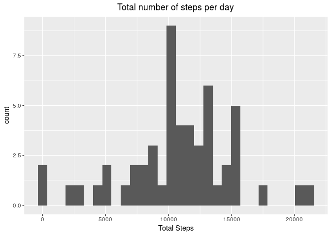
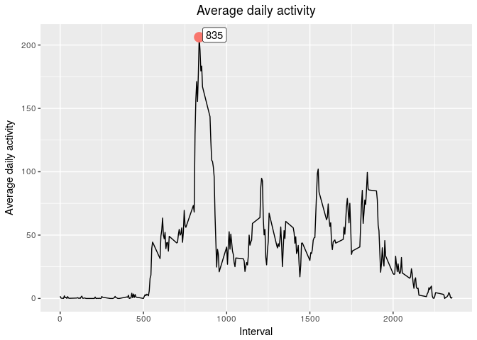
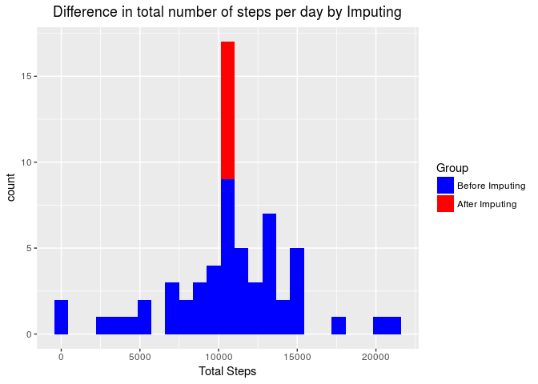
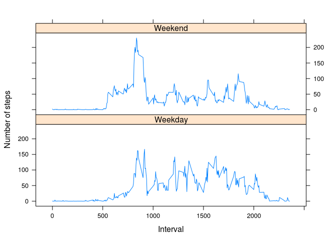

# Reproducible Research: Peer Assessment 1


## Loading and preprocessing the data

```r
#load activity data
unzip("./activity.zip")
activity_data <- read.csv("./activity.csv",sep=",")
#order data by date & steps
activity_data <- activity_data[order(activity_data$date, activity_data$steps), ]
#filter activity data without NA 
activity <- activity_data[!is.na(activity_data$steps), ]
```


## What is mean total number of steps taken per day?

```r
#calculate total number of steps taken per day 
activity_total <- activity %>% arrange(date, steps) %>% group_by(date) %>% summarise(sum = sum(steps))

#plot for Total number of steps per day
hist(activity_total$sum,main = "Total number of steps per day", xlab = "Total Steps")
```

<!-- -->

```r
# Display Mean & Median
summary(activity_total$sum)[3:4]
```

```
##   Median     Mean 
## 10765.00 10766.19
```


## What is the average daily activity pattern?

```r
# calculate average daily activity 
activity_interval_mean <- activity %>% group_by(interval) %>% summarise(steps = mean(steps))

# plot daily activity pattern
xyplot(steps~interval,
        data = activity_interval_mean,
        type="l",
        main="Average daily activity",
        xlab="Interval",
        ylab="average dialy activity",
        layout = c(1,1))
```

<!-- -->


## Imputing missing values

```r
# Process missing values by replacing NA's with mean number of steps 
activity_join <- left_join(activity_data, activity_interval_mean, by="interval")
na.steps <- which(is.na(activity_join$steps.x))
activity_join$steps.x[na.steps] <- activity_join$steps.y[na.steps]
activity_impute <- activity_join[ ,c("steps.x","date","interval")]
names(activity_impute)[1] <- "steps" 

# calculate total number of steps taken per day 
activity_imputed_total <- activity_impute %>% arrange(date, steps) %>% group_by(date) %>% summarise(sum = sum(steps))

#plot for Total number of steps per day
hist(activity_imputed_total$sum, main = "Total number of steps per day (Imputed data)", xlab = "Total Steps")
```

<!-- -->

```r
# display mean and median steps
summary(activity_imputed_total$sum)[3:4]
```

```
##   Median     Mean 
## 10766.19 10766.19
```


## Are there differences in activity patterns between weekdays and weekends?

```r
# group activity data by weekday & weekend 
weekdays <- c("Monday","Tuesday","Wednesday","Thursday","Friday")
activity_impute$wday <- factor(weekdays(as.Date(activity_impute$date)) %in% weekdays, levels=c(FALSE,TRUE), labels=c("Weekday","Weekend"))
# calculate mean activity 
activity_impute_mean <- activity_impute %>% group_by(interval,wday) %>% summarise(steps = mean(steps))
#plot activity patterns for weekdays and weekends
xyplot(steps ~ interval | levels(wday), 
           data = activity_impute_mean,
           type = "l",
           xlab = "Interval",
           ylab = "Number of steps",
           layout=c(1,2))
```

<!-- -->
